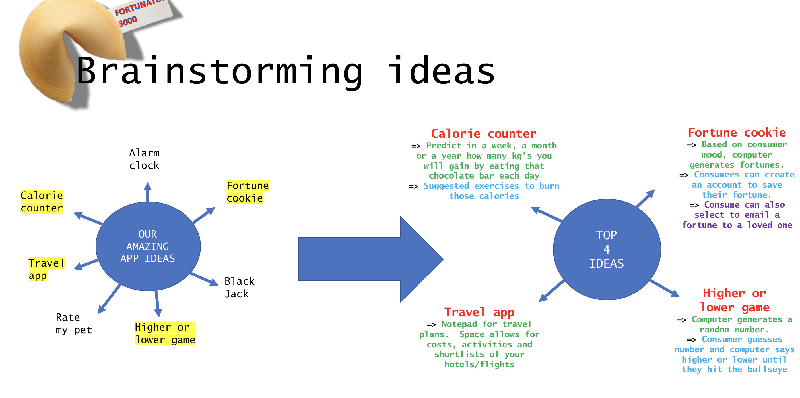
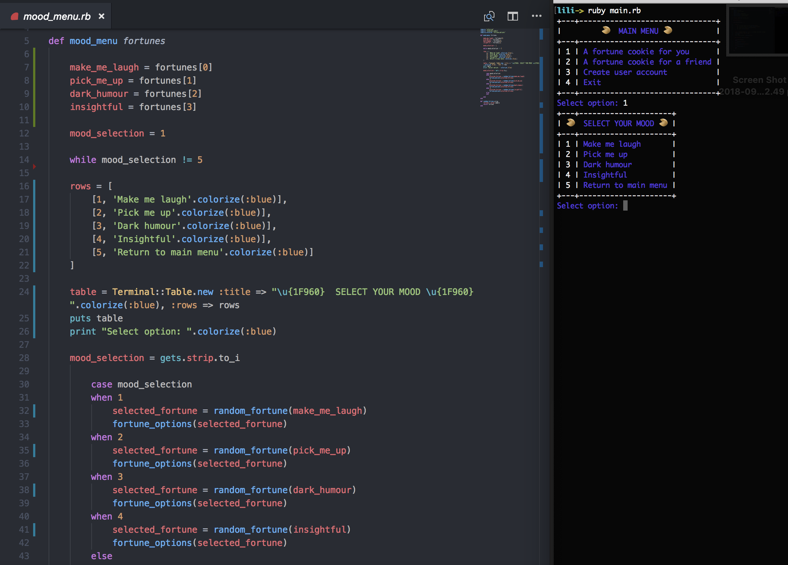
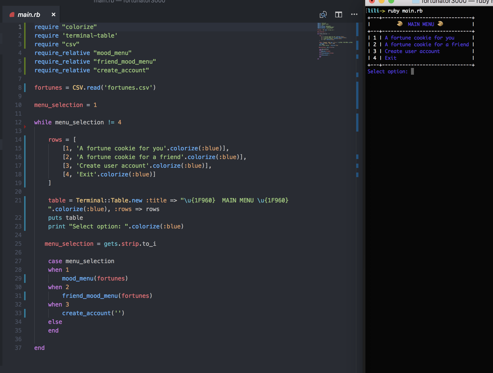
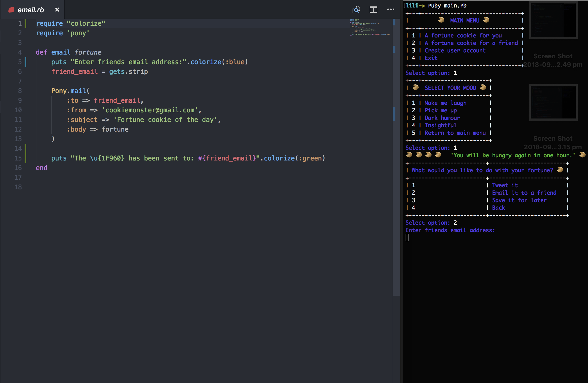
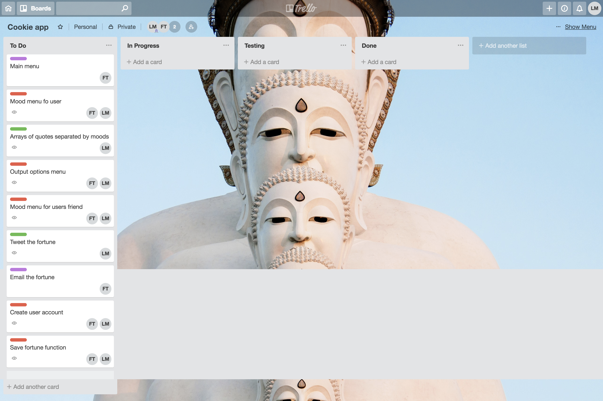
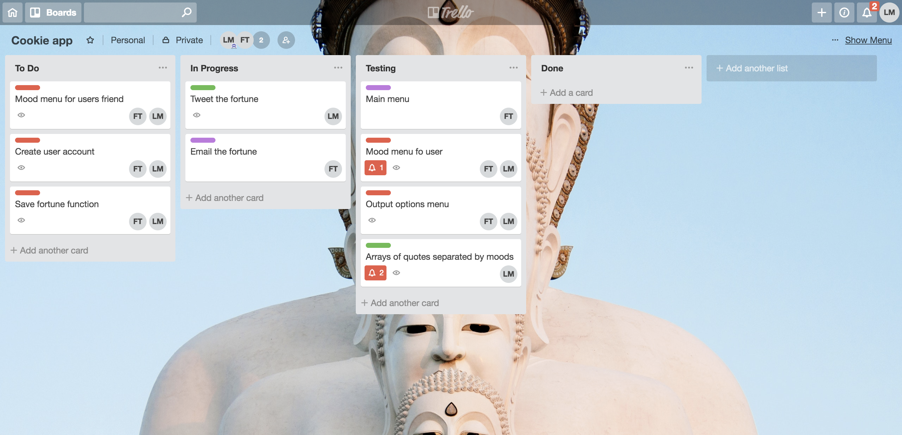
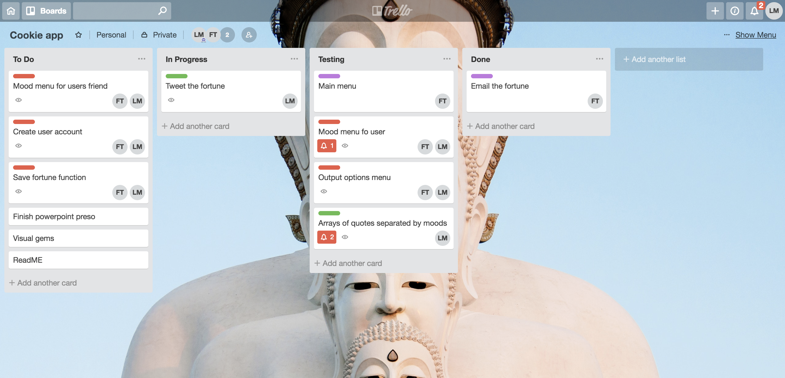

# Link to Github repository: 
https://github.com/lilianamolloy/fortunator3000

# Purpose: 
To display expertise within the terminal (CLI) by writing a compelling and entertaining application.    

The Fortunator3000 app provides the user with a daily fortune to brighten or enlighten their day.

# Functionality: 
- Ability to access fortunes by first selecting your mood (or type of fortune you would like to receive).
- Both the colorize and terminal table gems allows better readability.
- Included in the app is an option to send a fortune to a friend, enabled by the pony gem which requests the user name as well as the friends email address.  The fortune is pushed into the body of the email.
- Finally, an option is available to open a user account and save all fortunes so users can look back at accumulated fortures.
  

# Instructions for use:
- Prior to use, the following ruby gems are required for the app to run:
    - Pony (for email funtionality)
  ```ruby
  $ gem install pony
  ```
    - Colorize
  ```ruby
  $ gem install colorize
  ```
    - Terminal Table
  ```ruby
  $ gem install terminal-table
  ```

- Run main.rb
  ```ruby
  $ ruby main.rb
  ```
- At the main menu, use number selection (i.e. 1) to choose the type of fortune you would like to receive.
- If fortune is selected for yourself, once viewed you have the option to email it or save it in your own personal account (option to create account if one not already existing).
- If fortune is selected for a friend, you do not have the opportunity to view their fortune but rather email it directly to your friend.

# Brainstorming:


# App user/workflow diagram/project plan:


# Screenshots:





# Screenshots of Trello boards:




